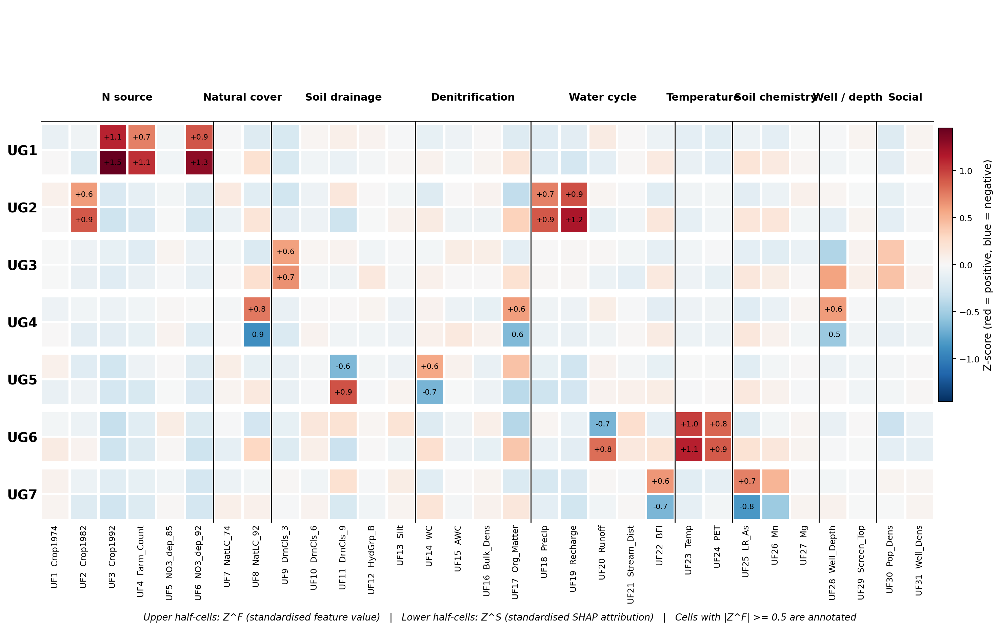
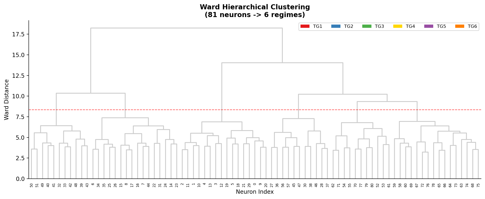

# SHAP-Compass

**Directional SHAP Attribution Clustering for GeoAI** — a Python toolkit
implementing the framework described in:

> *SHAP-Compass: A Regime Level Interpretability Framework for Revealing
> Spatially Heterogeneous Attribution Mechanisms in GeoAI.* ISPRS Journal
> of Photogrammetry and Remote Sensing, 2026 (under review).

SHAP-Compass projects every `(feature value, SHAP attribution)` pair onto
the unit circle, then groups samples whose attribution directionalities
are similar using a SOM + Ward two-stage clustering. The resulting
**attribution regimes** reveal how a single GeoAI model can encode
regionally distinct mechanisms, and the **Directional Consistency
Index (DCI)** quantifies which features behave universally versus
context-dependently across regimes.


> Stage 1 ingests features and attributions; Stage 2 jointly standardises
> them and projects each `(Z^F, Z^S)` pair onto the unit circle to form
> the N × 2J **SHAP-Compass matrix**; Stage 3 trains a SOM on that matrix
> and Ward-clusters the neuron-level directional fingerprints into K
> regimes; Stage 4 reports the DCI ranking, the bilayer feature heatmap,
> and the M01–M21 quality metrics.

---

## How directionality is encoded

Each `(Z^F_{n,j}, Z^S_{n,j})` pair is a point in the standardised plane.
SHAP-Compass reads it as a *compass bearing* — the angle θ tells you
**which way the model's attribution moves when the feature value moves**
— and then drops the magnitude `r` so that downstream clustering is
driven by mechanism direction, not by a handful of extreme samples.


> (a) Three illustrative samples on the `Z^F vs Z^S` plane.
> (b) Their direction angles θ and magnitudes r.
> (c) Unit-circle projection: only θ is retained, so two samples with the
> same mechanism but very different intensities end up at the same point
> on the circle.

## Key terminology

| Term | Symbol / role |
|---|---|
| attribution regime | label assigned by SHAP-Compass to each sample |
| attribution directionality | the property quantified by θ |
| SHAP-Compass matrix | N × 2J input to the SOM |
| directional fingerprint | 2J-dim vector per SOM neuron |
| Directional Consistency Index (DCI) | per-feature cross-regime concentration in [0, 1] |
| axial doubling | 2θ transform, so θ and θ + π are the same axis |
| bilayer feature heatmap | replaces the rose / polar diagrams used in earlier versions |

## Key features

- **Unit-circle projection** `(cos θ, sin θ)` eliminates magnitude bias.
- **Two-stage clustering** (Vesanto & Alhoniemi 2000): SOM on the
  SHAP-Compass matrix → Ward on the neuron-level fingerprints.
- **Directional Consistency Index (DCI)** with four interpretation bands
  (`>=0.75` high / `0.50-0.75` medium / `0.25-0.50` low / `<0.25`
  context-dependent). See the geometric intuition below.


> Each coloured spoke is one regime's centroid direction for a single
> feature. The black square is the **axial mean resultant** after the 2θ
> doubling transform; its length is DCI. Low DCI (panel a) — regimes
> disagree on direction, so the resultant collapses to near 0; high DCI
> (panel b) — regimes agree, so the resultant approaches 1.
- **21 quality metrics (M01–M21)** with two hard pre-filters and a
  three-core hierarchical selector (M13 stability, M18 low-target band
  separability, M20 target gap), optionally summarised with Borda voting.
- **Bilayer feature heatmap** — regimes × features split-cell layout
  (upper half = Z^F, lower half = Z^S, annotated when |Z^F| >= 0.5),
  with optional functional-dimension column grouping (Fig.7 / Fig.11 of
  the paper).
- **Per-feature unit-circle plot** — one subplot per feature, sorted by
  descending DCI, border colour-coded by DCI band (Fig.9 / Fig.13).
- **Directional Consensus Rate (DCR)** within-regime diagnostic.
- **Stage 2** r-vector intensity stratification with a four-condition
  decision rule for splitting strong / weak sub-regimes.
- **Multi-target** batch runner with pairwise ARI + DCI rank correlation.
- Works with **any attribution method** (SHAP, LIME, Integrated
  Gradients, ...). The reference implementation uses TreeExplainer.

## Installation

```bash
pip install -e .
```

The SHAP dependency is optional and is only required if you call
`SHAPCompass.from_model(...)`:

```bash
pip install -e .[shap]
```

## Quick start

```python
from shap_compass import SHAPCompass

compass = SHAPCompass(
    features=X,                # (n_samples, n_features)
    attributions=shap_values,  # (n_samples, n_features)
    feature_names=names,
    target=y,                  # used to relabel regimes by descending mean
)
results = compass.fit(som_grid=(9, 9), n_regimes=6, random_state=42)
results.summary()
```

```
============================================================
  SHAP-Compass Analysis Results
============================================================
  Samples:    2375
  Features:   17
  Regimes:    6
  eta^2 (target): 0.3514

  Regime sizes:
    R1:  340 (14.3%)
    R2:  327 (13.8%)
    ...

  DCI ranking (top 5):
    1. Leaching_Risk        DCI=0.978 (high)
    2. Rainfall             DCI=0.952 (high)
    3. Temperature          DCI=0.881 (high)
    4. Agri_Ratio           DCI=0.795 (high)
    5. Clay_Sand_Ratio      DCI=0.732 (medium)
============================================================
```

## Example output gallery

The figures below come from `examples/02_taiwan_synthetic.py`
(N = 2,375, J = 17 features in 7 functional dimensions, SOM 9×9, k = 6).
Re-running the script reproduces them exactly with `random_state=42`.

### Bilayer feature heatmap (Fig.7 / Fig.11 in the paper)


> Rows = regimes TG1..TG6 (descending mean target). Columns = features
> grouped by functional dimension with black separator lines. Each cell
> is split horizontally: **upper half = Z^F** (standardised feature
> value), **lower half = Z^S** (standardised SHAP attribution). Cells
> with `|Z^F| >= 0.5` are annotated. Mismatched colours between the two
> halves of a cell flag sign-flip mechanisms.

The same layout scales to 31 features / 9 dimensions in the
CONUS-style synthetic example:



### Per-feature unit-circle plot (Fig.9 / Fig.13)


> One small subplot per feature, sorted by descending DCI. Each spoke is
> a regime centroid. **Subplot border colour** encodes the DCI band:
> green ≥ 0.75 (universal), yellow 0.50–0.75, orange 0.25–0.50, red
> < 0.25 (context-dependent). At a glance you can read which features
> drive every regime the same way (green frames) and which features are
> regime-specific (red frames).

### DCI ranking


> DCI bar chart — features sorted by cross-regime direction consistency;
> bar colour encodes the DCI band (green high / yellow medium /
> orange low / red context-dependent).

### SOM neuron grid


> 9 × 9 SOM: (left) regime label per neuron, (centre) hit map showing
> samples-per-neuron, (right) per-neuron mean target value.

### Spatial regime distribution


> Synthetic spatial layout of the recovered regimes (left panel) and the
> target field (right panel) — `plot_spatial` / `plot_group_facets`
> reproduce Fig.8 / Fig.12 of the paper.

### Ward dendrogram



> Ward dendrogram on the neuron-level directional fingerprints —
> red dashed line marks the k = 6 cut.

## Producing the paper's headline figures

```python
from shap_compass.plotting import (
    plot_som_grid,
    plot_ward_dendrogram,
    plot_dci_ranking,
    plot_bilayer_heatmap,
    plot_per_feature_unit_circle,
    plot_spatial,
)

# Bilayer feature heatmap (Fig.7 / Fig.11)
plot_bilayer_heatmap(
    ZF_g, ZS_g, feature_names, n_groups=results.n_groups,
    feature_dimensions={
        "N source": ["Agri_Ratio", "Livestock_Ratio", ...],
        "Natural cover": ["Forest_Ratio", "Vegetation_Index"],
        # ...
    },
    feature_codes={"Agri_Ratio": "TF1", "Livestock_Ratio": "TF2", ...},
    regime_prefix="TG",
    save_path="bilayer_feature_heatmap.png",
)

# Per-feature unit-circle plot (Fig.9 / Fig.13)
plot_per_feature_unit_circle(
    results.group_theta, results.dci, feature_names,
    n_groups=results.n_groups,
    regime_prefix="TG",
    save_path="per_feature_unit_circle.png",
)
```

`plot_bilayer_heatmap` is the explicit replacement for the rose / polar
diagrams used in early internal versions of this code. The split-cell
layout makes the Z^F vs Z^S coupling per regime visible at a glance and
scales gracefully to the J = 76 features of the CONUS case in the paper.

## Examples

Three runnable demos, all **synthetic only** (see `examples/README.md`):

| Script | Samples | Features | SOM | k |
|---|---|---|---|---|
| `examples/01_quickstart.py` | 500 | 8 | 7×7 | 3 |
| `examples/02_taiwan_synthetic.py` | 2,375 | 17 (7 dimensions) | 9×9 | 6 |
| `examples/03_conus_synthetic.py` | 6,000 | 35 (9 dimensions) | 20×20 | 7 |

Run them from the repository root:

```bash
python examples/01_quickstart.py
python examples/02_taiwan_synthetic.py
python examples/03_conus_synthetic.py
```

Each script writes its figures and CSVs under `examples/<name>/output/`.

### Why no real data?

The published case studies use Taiwan EPA groundwater monitoring data
and the Ransom et al. (2022) CONUS compilation. The Taiwan dataset is
distributed under access-restricted terms (permit holders only), and
both originals are best fetched from the authoritative sources directly.
The package therefore ships **only synthetic generators** that reproduce
the directional structure of the paper (multiple regimes with distinct
Z^F / Z^S signatures, functional feature groupings, ordered target
range) — enough to exercise the full pipeline end-to-end without any
external downloads.

## Quality metrics (M01–M21)

| Group | Metrics |
|---|---|
| Signal chain | M01 sum-SHAP~target R², M02 non-linearity richness |
| SOM diagnostics | M03 topological preservation, M04 quantisation, M05 neuron utilisation |
| Direction-vs-magnitude | M06 signal uniqueness, M07 SHAP-Compass richness |
| Internal validity | M08 silhouette, M09 Calinski-Harabasz, M10 Davies-Bouldin, M11 cophenetic |
| External validation | M12 eta², M13 bootstrap ARI, M14 OOS retention, M15 within-regime sign agreement |
| Mechanism / k | M16 anti-cyclicity, M17 k-optimality, **M18 low-target eta²** |
| Interpretability | **M19 evenness (>=3% floor)**, **M20 adjacent target gap / IQR**, M21 inter-regime diversity |

Hard pre-filters: **M05 == 1.0** (no dead neurons) and **M19 min
fraction >= 0.03**. Within the valid pool, **M13 / M18 / M20** are the
three core selectors used in Section 2.4 of the paper.

```python
from shap_compass import compute_all_metrics, borda_rank
metrics = compute_all_metrics(
    results, target=y,
    features_raw=X, attributions_raw=shap_values,
)
```

## Advanced features

### Directional Consensus Rate (DCR)

```python
from shap_compass import check_consensus_from_results
report = check_consensus_from_results(results, top_n=5)
print(report.summary())
```

### Stage 2 intensity stratification

```python
from shap_compass import intensity_stratify_from_results
s2 = intensity_stratify_from_results(results, target=y, features_raw=X)
s2.print_summary()
```

### Multi-target analysis

```python
from shap_compass import run_multi_target

multi = run_multi_target(
    features=X,
    attributions_dict={"NO3": shap_no3, "pH": shap_ph},
    targets_dict={"NO3": y_no3, "pH": y_ph},
    feature_names=names,
    output_dir="output",
)
multi.summary()
```

### From a trained model (auto-SHAP)

```python
compass = SHAPCompass.from_model(
    model=trained_model,    # any sklearn-compatible regressor
    X=X_test,
    target=y_test,
    explainer_type="auto",  # tries TreeExplainer first
)
results = compass.fit()
```

### Reusing a pre-trained SOM

```python
import pickle
with open("som_model.pkl", "rb") as f:
    som = pickle.load(f)
results = compass.fit(pretrained_som=som)
```

## API reference

### Core

| Object | Description |
|---|---|
| `SHAPCompass(features, attributions, feature_names, target)` | Main entry point |
| `SHAPCompass.fit(som_grid, n_regimes, ...)` | Run the full pipeline |
| `SHAPCompass.from_model(model, X, target, ...)` | Auto-compute SHAP + run |
| `SHAPCompassResults` | Result container (see below) |

`SHAPCompassResults` attributes:

| Attribute | Shape | Description |
|---|---|---|
| `.labels` | (n,) | Regime labels (1-indexed) |
| `.theta` | (n, p) | Direction angles |
| `.r` | (n, p) | Signal magnitudes |
| `.cossin` | (n, 2p) | Per-sample SHAP-Compass vectors |
| `.ZF` | (n, p) | Standardised feature values |
| `.ZS` | (n, p) | Standardised attributions |
| `.neuron_labels`, `.neuron_theta`, `.neuron_cossin`, `.neuron_sizes` | various | SOM-level results |
| `.group_theta` | (k, p) | Regime centroid direction angles |
| `.dci` | DataFrame | DCI ranking table (feature, DCI, rank, band) |
| `.eta_sq` | float | eta² discrimination of the target by regime |

### Plotting

| Function | Output |
|---|---|
| `plot_som_grid` | SOM neuron map + hit map (+ optional target panel) |
| `plot_ward_dendrogram` | Ward dendrogram on neuron-level fingerprints |
| `plot_dci_ranking` | DCI bar chart with four DCI bands |
| `plot_bilayer_heatmap` | Bilayer feature heatmap (Fig.7 / Fig.11) |
| `plot_per_feature_unit_circle` | Per-feature regime centroid panels (Fig.9 / Fig.13) |
| `plot_theta_heatmap` | Regime × feature angle heatmap |
| `plot_group_overview` | Regime target-mean bar chart + Z^S heatmap |
| `plot_spatial` / `plot_group_facets` | Spatial regime maps |

### Fit parameters

| Parameter | Default | Description |
|---|---|---|
| `som_grid` | `(9, 9)` | SOM grid size. Paper uses (9, 9) for Taiwan / (20, 20) for CONUS. |
| `n_regimes` | `6` | Number of attribution regimes (Ward's k). |
| `use_som` | `True` | If `False`, apply Ward directly to the sample-level SHAP-Compass matrix. |
| `som_sigma`, `som_lr`, `som_iterations` | `1.5`, `0.5`, `10000` | MiniSom hyperparameters. |
| `random_state` | `42` | Seed forwarded to MiniSom. |
| `pretrained_som` | `None` | Reuse a previously trained MiniSom. |

## Citation

If you use SHAP-Compass in your research, please cite the paper:

```bibtex
@article{shapcompass2026,
  title   = {{SHAP}-Compass: A Regime Level Interpretability Framework for
             Revealing Spatially Heterogeneous Attribution Mechanisms in GeoAI},
  journal = {ISPRS Journal of Photogrammetry and Remote Sensing},
  year    = {2026},
  note    = {Under review}
}
```

Foundational references (also worth citing where relevant):

- Lundberg & Lee (2017); Lundberg et al. (2020, *Nature Machine Intelligence*) — SHAP.
- Kohonen (2001); Vesanto & Alhoniemi (2000) — SOM + Ward two-stage.
- Ward (1963); Caliński & Harabasz (1974); Rousseeuw (1987); Davies & Bouldin (1979) — clustering validity.
- Mardia & Jupp (2000); Fisher (1993) — circular statistics, axial doubling.
- Dalmaijer, Nord & Astle (2022) — minimum-cluster-fraction threshold.
- Ransom et al. (2022, *Science of the Total Environment*) — CONUS validation case.
- Poff et al. (1997); Wallace & Gutzler (1981); Bond & Keeley (2005) — the *regime* lineage that motivates the "attribution regime" terminology.

## Regenerating the README's figures

```bash
# Conceptual figures (pipeline, unit-circle projection, DCI geometry)
python docs/build_concept_figures.py

# Example output figures — re-run an example, then copy its PNGs into docs/figures/
python examples/02_taiwan_synthetic.py
cp examples/taiwan_synthetic/output/figures/*.png docs/figures/
```

The example output directories under `examples/*/output/` are
`.gitignore`d; `docs/figures/` and `docs/concepts/` are tracked so the
README always renders on GitHub even before a user runs anything.

## License

MIT. See [LICENSE](LICENSE).
