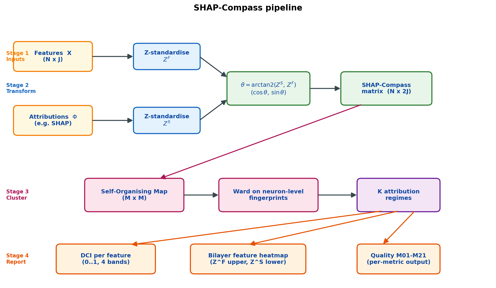
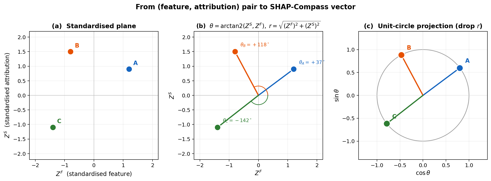
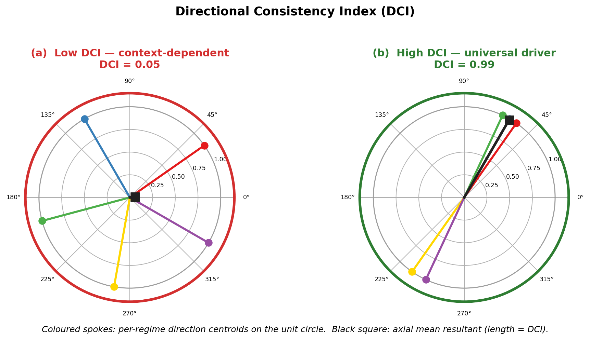
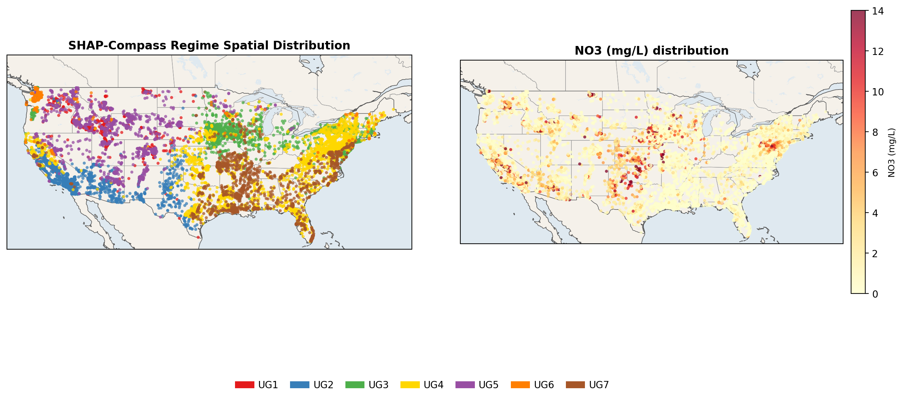
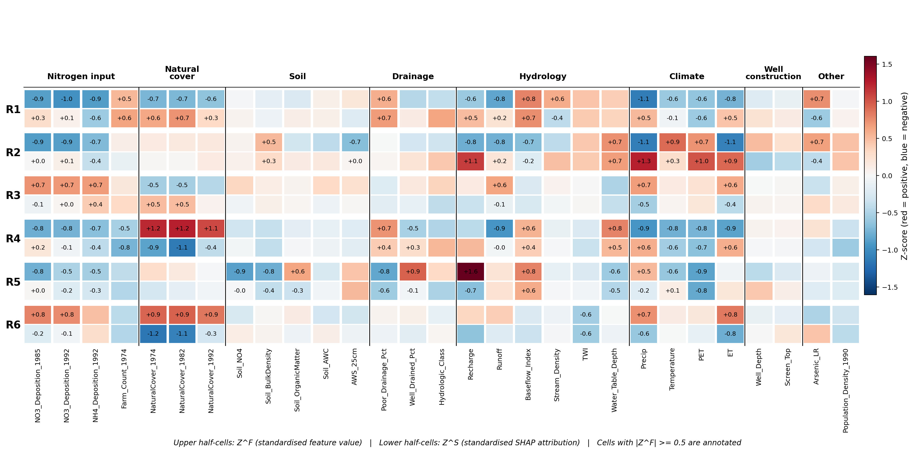
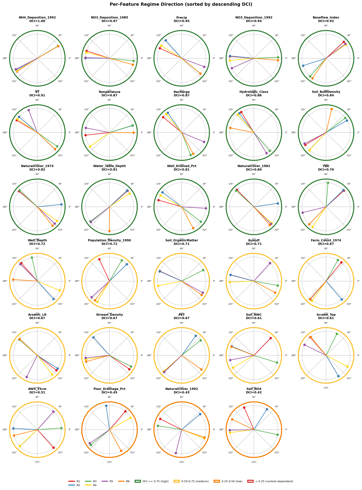
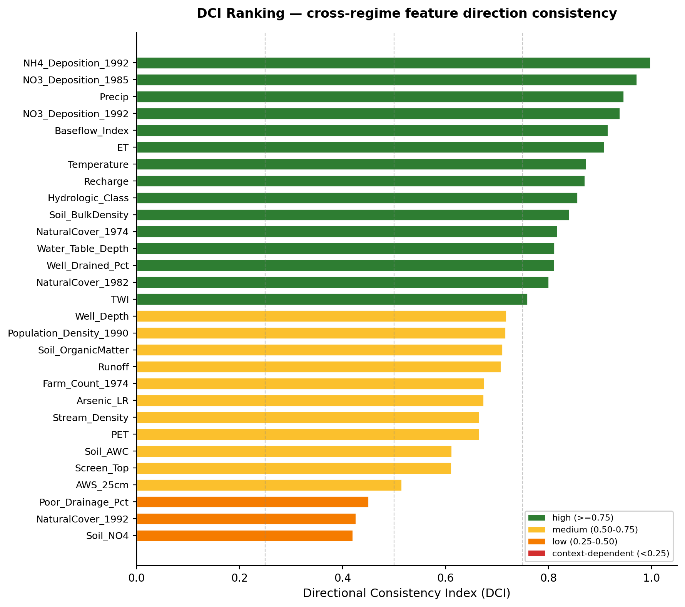
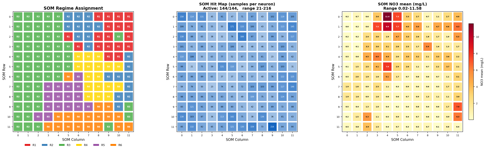

# SHAP-Compass

## SHAP-Compass Introduction

SHAP-Compass projects every `(feature value, SHAP attribution)` pair onto
the unit circle, then groups samples whose attribution directionalities
are similar using a SOM + Ward two-stage clustering. The resulting
**attribution regimes** reveal how a single model can encode regionally
distinct mechanisms, and the **Directional Consistency Index (DCI)**
quantifies which features behave universally versus context-dependently
across regimes.



> **Stage 1** ingests features and attributions; **Stage 2** jointly
> standardises them and projects each $(Z^{F}, Z^{S})$ pair onto the
> unit circle to form the $N \times 2J$ SHAP-Compass matrix;
> **Stage 3** trains a SOM on that matrix and Ward-clusters the
> neuron-level directional fingerprints into $K$ regimes; **Stage 4**
> reports the DCI ranking, the bilayer feature heatmap, and the M01–M21
> quality metrics.

---

## How directionality is encoded

Each  $(Z^{F}_{n,j}, Z^{S}_{n,j})$  pair is a point in the standardised
plane. SHAP-Compass reads it as a *compass bearing* — the angle $\theta$
tells you **which way the model's attribution moves when the feature
value moves** — and then drops the magnitude $r$ so that downstream
clustering is driven by mechanism direction, not by a handful of extreme
samples.



> (a) Three illustrative samples on the $(Z^{F}, Z^{S})$ plane.
> (b) Their direction angles $\theta$ and magnitudes $r$.
> (c) Unit-circle projection: only $\theta$ is retained, so two samples
> with the same mechanism but very different intensities end up at the
> same point on the circle.

## Key terminology

| Term                                | Symbol / role                                              |
| ----------------------------------- | ---------------------------------------------------------- |
| attribution regime                  | label assigned by SHAP-Compass to each sample              |
| attribution directionality          | the property quantified by θ                              |
| SHAP-Compass matrix                 | `N × 2J` input to the SOM                               |
| directional fingerprint             | `2J`-dim vector per SOM neuron                           |
| Directional Consistency Index (DCI) | per-feature cross-regime concentration in `[0, 1]`       |
| axial doubling                      | `2θ` transform, so θ and `θ + π` are the same axis |
| bilayer feature heatmap             | split-cell$(Z^{F}, Z^{S})$ view per regime × feature    |

## Key features

- **Unit-circle projection** `(cos θ, sin θ)` eliminates magnitude bias.
- **Two-stage clustering**: SOM on the SHAP-Compass matrix → Ward on the
  neuron-level fingerprints.
- **Directional Consistency Index (DCI)** with four interpretation
  bands (`>=0.75` high / `0.50-0.75` medium / `0.25-0.50` low / `<0.25`
  context-dependent). See the geometric intuition below.



> Each coloured spoke is one regime's centroid direction for a single
> feature. The black square is the **axial mean resultant** after the
> `2θ` doubling transform; its length is DCI. Low DCI (panel a) —
> regimes disagree on direction, so the resultant collapses to near 0;
> high DCI (panel b) — regimes agree, so the resultant approaches 1.

- **21 quality metrics (M01–M21)** with two hard pre-filters and a
  three-core hierarchical selector (M13 stability, M18 low-target band
  separability, M20 target gap). Each metric is reported independently;
  no aggregate score is produced.
- **Bilayer feature heatmap** — regimes × features split-cell layout
  (upper half = $Z^{F}$, lower half = $Z^{S}$, annotated when
  $|Z^{F}| \geq 0.5$), with optional functional-dimension column
  grouping.
- **Per-feature unit-circle plot** — one subplot per feature, sorted by
  descending DCI, border colour-coded by DCI band.
- Works with **any attribution method** (SHAP, LIME, Integrated
  Gradients, …). The bundled examples use SHAP `TreeExplainer`.
- **Bundled real-world dataset** (`load_conus_nitrate()`) — the public
  CONUS groundwater nitrate release ships with the package, so the
  examples run end-to-end with no external download.

## Installation

```bash
pip install -e .
```

The bundled examples additionally need the `shap` library to compute
attributions. Install it via the optional extra:

```bash
pip install -e ".[shap]"
```

SHAP-Compass itself does not call any SHAP explainer — you supply the
attribution matrix. The `shap` extra exists purely for the example
scripts.

## Quick start

The shortest end-to-end usage with your own data:

```python
from shap_compass import SHAPCompass

compass = SHAPCompass(
    features=X,                # (n_samples, n_features) raw feature matrix
    attributions=shap_values,  # (n_samples, n_features) attribution matrix
    feature_names=feature_names,
    target=y,                  # used to relabel regimes by descending mean
)
results = compass.fit(som_grid=(20, 20), n_regimes=7, random_state=42)
results.summary()
```

Sample output:

```
============================================================
  SHAP-Compass Analysis Results
============================================================
  Samples:    12082
  Features:   29
  Regimes:    7
  eta^2 (target): 0.0655

  Regime sizes:
    UG1:  1587 (13.1%)
    UG2:  1905 (15.8%)
    UG3:  2014 (16.7%)
    UG4:  2985 (24.7%)
    UG5:  1480 (12.2%)
    UG6:   625 ( 5.2%)
    UG7:  1486 (12.3%)

  DCI ranking (top 5):
    1. NH4_Deposition_1992  DCI=0.985 (high)
    2. PET                  DCI=0.965 (high)
    3. NaturalCover_1982    DCI=0.955 (high)
    4. NaturalCover_1974    DCI=0.953 (high)
    5. Poor_Drainage_Pct    DCI=0.932 (high)
============================================================
```

## Bringing your own data and model

`SHAPCompass(...)` only requires three matrices and an optional target:

| Argument          | Shape                          | Notes                                                                                                                                                  |
| ----------------- | ------------------------------ | ------------------------------------------------------------------------------------------------------------------------------------------------------ |
| `features`      | `(n_samples, n_features)`    | Raw feature values. Any numeric matrix; can be NumPy, pandas, or polars (converted internally).                                                        |
| `attributions`  | `(n_samples, n_features)`    | Per-sample × per-feature attributions. Typically SHAP values, but LIME, Integrated Gradients, or any other method is accepted.                        |
| `feature_names` | list of `n_features` strings | Used for axis labels and the DCI table.                                                                                                                |
| `target`        | `(n_samples,)`, optional     | Numeric target. If provided, regimes are relabelled in descending order of mean target — useful for ordered phenomena (e.g. pollution concentration). |

A minimal real-world recipe with scikit-learn + SHAP:

```python
import numpy as np
from sklearn.ensemble import GradientBoostingRegressor
import shap
from shap_compass import SHAPCompass

# 1) Train any regressor on your (X, y).
model = GradientBoostingRegressor(random_state=42).fit(X, y)

# 2) Compute attributions any way you like.
shap_values = shap.TreeExplainer(model).shap_values(X)

# 3) Run SHAP-Compass.
results = SHAPCompass(
    features=X, attributions=shap_values,
    feature_names=feature_names, target=y,
).fit(som_grid=(20, 20), n_regimes=7, random_state=42)
```

For a runnable version, see `examples/01_quickstart.py`.

## Bundled CONUS groundwater dataset

The package ships with a 12,082-well subset of the **U.S. Geological
Survey CONUS groundwater nitrate release** (Ransom et al. 2021), which
is in the public domain. The bundled CSV keeps 29 features spanning
nitrogen inputs, land use, soil, drainage, hydrology, climate, well
construction and population, plus well coordinates and the target
`NO3` (mg/L).

```python
from shap_compass import load_conus_nitrate, CONUS_FEATURE_NAMES

# Default: pandas DataFrame with lat, lon, NO3, and the 29 features.
df = load_conus_nitrate()

# Get X / y as NumPy arrays directly.
X, y = load_conus_nitrate(return_X_y=True)

# Quick demo: sub-sample for speed.
df_small = load_conus_nitrate(sample_size=2000, random_state=42)
```

The original data release is cited in `shap_compass/data/conus.py` and
linked under [References](#references) below.

## Example output gallery

All figures below come from `examples/02_conus_full_pipeline.py` running
on the bundled CONUS dataset (12,082 wells, 29 features in 8 functional
dimensions, SOM 20×20, k = 7 regimes labelled `UG1..UG7`). Re-running
the script reproduces them exactly with `random_state=42`.

> **Adapting to your own target.** The "NO3 (mg/L)" labels below come
> from this specific example. When you call `plot_som_grid` or
> `plot_spatial` on your own data, pass `target_label="..."` (and any
> string you like — e.g. `"Median income (USD)"`, `"PM2.5 (μg/m³)"`)
> and the figure titles, colourbar, and axis labels update accordingly.
> Every plotting function is data-agnostic: nothing about NO3,
> groundwater, or mg/L is hard-coded in the package.

### Spatial regime distribution



> Left: recovered regimes (`UG1..UG7`) on the CONUS well map. Right:
> NO3 concentrations on the same coordinates. The clusters form
> spatially coherent zones even though SHAP-Compass uses **no spatial
> coordinates at all** — the geographic structure emerges purely from
> the directional attribution mechanisms encoded by $(Z^{F}, Z^{S})$.

### Bilayer feature heatmap



> Rows = regimes `UG1..UG7` (descending mean NO3). Columns = the 29
> features grouped by functional dimension with black separator lines.
> Each cell is split horizontally: **upper half = $Z^{F}$**
> (standardised feature value), **lower half = $Z^{S}$** (standardised
> SHAP attribution). Cells with $|Z^{F}| \geq 0.5$ are annotated.
> Mismatched colours between a cell's two halves flag **sign-flip
> mechanisms** — the same feature value pushes the model up in one
> regime and down in another.

### Per-feature unit-circle plot



> One panel per feature, sorted by descending DCI. Each spoke is one
> regime centroid on the $(Z^{F}, Z^{S})$ unit circle. **Subplot border
> colour** encodes the DCI band: green ≥ 0.75 (universal),
> yellow 0.50–0.75, orange 0.25–0.50, red < 0.25 (context-dependent).

### DCI ranking



> DCI bar chart — features sorted by cross-regime direction consistency;
> bar colour encodes the DCI band (green high / yellow medium /
> orange low / red context-dependent).

### SOM neuron grid



> 20 × 20 SOM: (left) regime label per neuron, (centre) hit map showing
> samples-per-neuron, (right) per-neuron mean NO3.

## Examples

| Script                                 | What it does                                                            |
| -------------------------------------- | ----------------------------------------------------------------------- |
| `examples/01_quickstart.py`          | ~2,000-sample demo end-to-end in under a minute.                        |
| `examples/02_conus_full_pipeline.py` | Full 12,082-sample analysis with all gallery figures and CSV summaries. |

Run them from the repository root:

```bash
pip install -e ".[shap]"
python examples/01_quickstart.py
python examples/02_conus_full_pipeline.py
```

The full pipeline writes its figures and CSVs under
`examples/conus_output/`.

## Output files

The full pipeline example produces:

| File                                    | Contents                                                           |
| --------------------------------------- | ------------------------------------------------------------------ |
| `figures/som_grid.png`                | SOM neuron map: regime labels, hit counts, per-neuron mean target. |
| `figures/dci_ranking.png`             | Per-feature DCI bar chart, coloured by DCI band.                   |
| `figures/bilayer_feature_heatmap.png` | Regime × feature split-cell heatmap.                              |
| `figures/per_feature_unit_circle.png` | One unit-circle panel per feature.                                 |
| `figures/spatial_distribution.png`    | Recovered regimes alongside the target field.                      |
| `dci_ranking.csv`                     | Per-feature DCI, rank, and band.                                   |
| `quality_metrics.csv`                 | One row per quality metric (M01–M21); no aggregate score.         |
| `regime_assignments.csv`              | Per-sample lat, lon, target, and recovered regime label.           |

Output directories under `examples/*/` are `.gitignore`d; re-run the
scripts to regenerate them.

## Quality metrics (M01–M21)

| Group                  | Metrics                                                                                                  |
| ---------------------- | -------------------------------------------------------------------------------------------------------- |
| Signal chain           | M01 sum-SHAP~target R², M02 non-linearity richness                                                      |
| SOM diagnostics        | M03 topological preservation, M04 quantisation, M05 neuron utilisation                                   |
| Direction-vs-magnitude | M06 signal uniqueness, M07 SHAP-Compass richness                                                         |
| Internal validity      | M08 silhouette, M09 Calinski-Harabasz, M10 Davies-Bouldin, M11 cophenetic                                |
| External validation    | M12 eta², M13 bootstrap ARI, M14 OOS retention, M15 within-regime sign agreement                        |
| Mechanism / k          | M16 anti-cyclicity, M17 k-optimality,**M18 low-target eta²**                                      |
| Interpretability       | **M19 evenness (>=3% floor)**, **M20 adjacent target gap / IQR**, M21 inter-regime diversity |

Hard pre-filters: **M05 == 1.0** (no dead neurons) and
**M19 min fraction >= 0.03**. Within the valid pool, **M13 / M18 / M20**
are the three core selectors.

```python
import pandas as pd
from shap_compass import compute_all_metrics

metrics = compute_all_metrics(
    results, target=y,
    features_raw=X, attributions_raw=shap_values,
)

# Write each metric on its own row — no aggregation.
pd.DataFrame(
    [{"metric": k, "value": v} for k, v in sorted(metrics.items())]
).to_csv("quality_metrics.csv", index=False)
```

## API reference

### Core

| Object                                                         | Description                                 |
| -------------------------------------------------------------- | ------------------------------------------- |
| `SHAPCompass(features, attributions, feature_names, target)` | Main entry point.                           |
| `SHAPCompass.fit(som_grid, n_regimes, ...)`                  | Run the full pipeline.                      |
| `SHAPCompassResults`                                         | Result container (see below).               |
| `load_conus_nitrate(...)`                                    | Load the bundled CONUS groundwater dataset. |

`SHAPCompassResults` attributes:

| Attribute                                                                    | Shape       | Description                                                   |
| ---------------------------------------------------------------------------- | ----------- | ------------------------------------------------------------- |
| `.labels`                                                                  | `(n,)`    | Regime labels (1-indexed).                                    |
| `.theta`                                                                   | `(n, p)`  | Direction angles.                                             |
| `.r`                                                                       | `(n, p)`  | Signal magnitudes.                                            |
| `.cossin`                                                                  | `(n, 2p)` | Per-sample SHAP-Compass vectors.                              |
| `.ZF`                                                                      | `(n, p)`  | Standardised feature values.                                  |
| `.ZS`                                                                      | `(n, p)`  | Standardised attributions.                                    |
| `.neuron_labels`, `.neuron_theta`, `.neuron_cossin`, `.neuron_sizes` | various     | SOM-level results.                                            |
| `.group_theta`                                                             | `(k, p)`  | Regime centroid direction angles.                             |
| `.dci`                                                                     | DataFrame   | DCI ranking table (`feature`, `DCI`, `rank`, `band`). |
| `.eta_sq`                                                                  | float       | eta² discrimination of the target by regime.                 |

### Plotting

| Function                                 | Output                                              |
| ---------------------------------------- | --------------------------------------------------- |
| `plot_som_grid`                        | SOM neuron map + hit map (+ optional target panel). |
| `plot_dci_ranking`                     | DCI bar chart with four DCI bands.                  |
| `plot_bilayer_heatmap`                 | Bilayer feature heatmap.                            |
| `plot_per_feature_unit_circle`         | Per-feature regime centroid panels.                 |
| `plot_theta_heatmap`                   | Regime × feature angle heatmap.                    |
| `plot_group_overview`                  | Regime target-mean bar chart +$Z^{S}$ heatmap.    |
| `plot_spatial` / `plot_group_facets` | Spatial regime maps.                                |

### Fit parameters

| Parameter                                     | Default                     | Description                                                                |
| --------------------------------------------- | --------------------------- | -------------------------------------------------------------------------- |
| `som_grid`                                  | `(9, 9)`                  | SOM grid size.                                                             |
| `n_regimes`                                 | `6`                       | Number of attribution regimes (Ward's k).                                  |
| `use_som`                                   | `True`                    | If `False`, apply Ward directly to the sample-level SHAP-Compass matrix. |
| `som_sigma`, `som_lr`, `som_iterations` | `1.5`, `0.5`, `10000` | MiniSom hyperparameters.                                                   |
| `random_state`                              | `42`                      | Seed forwarded to MiniSom.                                                 |

## References

Methodological foundations:

- Lundberg & Lee (2017); Lundberg et al. (2020, *Nature Machine Intelligence*) — SHAP.
- Kohonen (2001); Vesanto & Alhoniemi (2000) — SOM + Ward two-stage clustering.
- Ward (1963); Caliński & Harabasz (1974); Rousseeuw (1987); Davies & Bouldin (1979) — clustering validity.
- Mardia & Jupp (2000); Fisher (1993) — circular statistics, axial doubling.
- Dalmaijer, Nord & Astle (2022) — minimum-cluster-fraction threshold.

Bundled dataset:

- Ransom, K.M., Nolan, B.T., Stackelberg, P.E., Belitz, K., Fram, M.S.
  (2021). *Machine learning predictions of nitrate in groundwater used
  for drinking supply in the conterminous United States: data release*.
  U.S. Geological Survey. [https://doi.org/10.5066/P9PQ622D](https://doi.org/10.5066/P9PQ622D)

## Regenerating the README's figures

```bash
# Conceptual figures (pipeline, unit-circle projection, DCI geometry)
python docs/build_concept_figures.py

# Gallery figures — re-run the CONUS example, then copy PNGs into docs/figures/
python examples/02_conus_full_pipeline.py
cp examples/conus_output/figures/*.png docs/figures/
```

## Acknowledgement

This work was supported (in part) by the National Science and Technology Council (NSTC), Taiwan, under grant numbers NSTC 114-2634-F-005-002 (Smart Sustainable New Agriculture Research Center, SMARTer) and NSTC 114-2121-M-005-007-MY2.

## License

Released under the MIT License — © 2026 GeoAI-Sustainability-Lab.
See [LICENSE](LICENSE) for the full text.
